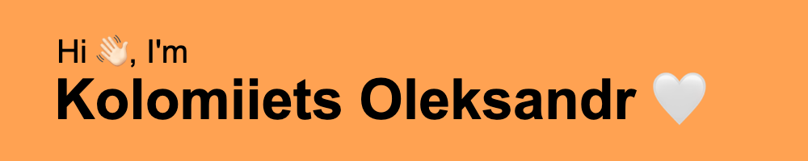

  

<h3>I'm a Software Engineering student at Kyiv School of Economics. Proficient in Python, C#, and Git, I'm a motivated individual keen on enhancing my skills and expanding my IT knowledge. I actively pursue relevant courses to stay current with industry trends.</h2>

- 🔭 I’m currently working on [**Hex-strategy game**](https://github.com/KolomiietsOleksandr/NoneName-Hex-Game) 

- 🌱 I’m currently learning **Web Development, Client-Server Concepts**

- 📄 Know about my experiences [**resume**](https://media.licdn.com/dms/document/media/D4D2DAQGXlnlMQXqQbg/profile-treasury-document-pdf-analyzed/0/1699286799374?e=1706745600&v=beta&t=yqio4j8uQI0JUUKT2eyNe7eTJeaZ1dDUguMuZ5mwkMo)

- ⚡ Fun fact **After all, war is war, and the Russian is for lunch**

- 📫 How to reach me ⬇︎  
  
  
  
  
  

